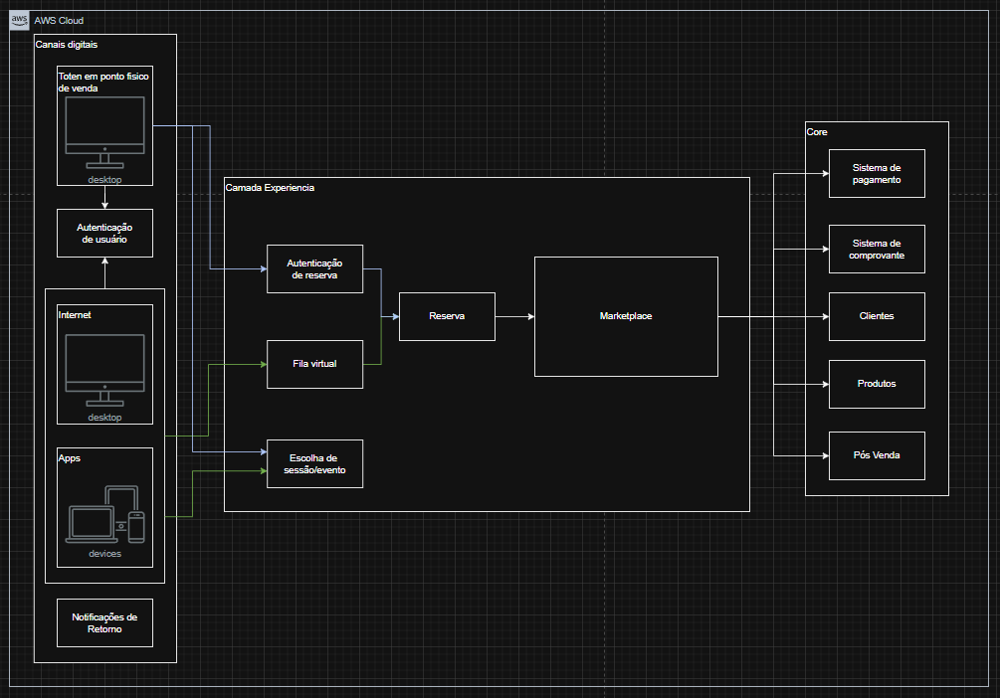

Documentação do Sistema de Bilheteria 

Visão Geral

Este sistema de bilheteria permite que usuários realizem cadastro, login, entrem em filas virtuais, reservem assentos e gerenciem suas reservas para eventos. O sistema foi desenvolvido em Python, utilizando manipulação de arquivos CSV para persistência dos dados e uma arquitetura modular para facilitar manutenção e escalabilidade.

---

Como Utilizar o projeto

1. Pré-requisitos

- Python 3.10+ instalado em sua máquina.
- Recomenda-se o uso do terminal do VS Code ou Prompt de Comando do Windows.

2. Executando a Aplicação

1. Abra o terminal na raiz do projeto (bilheteria).
2. Va até a pasta code/ 
2. Execute o comando abaixo para iniciar o sistema:

python bilheteria.py

3. Siga as instruções exibidas no terminal para navegar pelas funcionalidades do sistema, como cadastro, login, reserva de assentos, etc.

---

Estrutura Geral

- code/: Contém todo o código-fonte do sistema.
  - services/: Serviços organizados por domínio (autenticação, fila virtual, reserva, etc.).
  - repositories/: Camada de acesso a dados (leitura e escrita em CSV).
  - models/: Definição das entidades do sistema.
  - use_cases/: Lógica de utilização do módulo
  - controllers/: Lógica de controle e orquestração das operações.
  - utils/: Utilitários, como manipulação de CSV.
- bilheteria.py: Ponto de entrada da aplicação.
- Bilheteria.drawio: Diagrama da arquitetura do sistema.

---

Arquitetura do Sistema

O sistema foi baseado em uma arquitetura de microsserviços AWS demonstrada de maneira macro pelo fluxo abaixo:

A arquitetura completa com do sistema com decisões tecnicas está documentada no arquivo Bilheteria.drawio, localizado na raiz do projeto.  
Esse arquivo pode ser aberto com o draw.io (https://app.diagrams.net/) ou com extensões compatíveis no VS Code.

([arquitura online](https://drive.google.com/file/d/1bf0bW3I_wGfjEkM1CzY8Zi1apX_R9hcF/view?usp=drive_link))

---

Jornada do Cliente

Ponto de venda fisico (toten, caixa de atendimento):
  - Autenticação
  - Escolha sessão/evento
  - Reserva de ingresso
  - Marketplace
  - Pagamento
  - Comprovante
  - Pós Venda

Ponto de venda online (App e Internet):
  - Autenticação
  - Escolha sessão/evento
  - Fila online
  - Reserva de ingresso
  - Marketplace
  - Pagamento
  - Comprovante
  - Pós Venda

A diferenciação foi projetada para que o cliente no ponto de venda fisico não seja duplamente direcionado a fila, ja que os totens ou caixas são limitados e uma fila fisica deve ser estabelecida.

---

Principais decisões tecnicas: 

- O sistema foi construído em microsserviços AWS e prezando pelo novo modelo de arquitetura proposto pela CIS segregando a jornada do cliente em 3 camadas: Canal, Experiência e Core. Sendo Canal o ponto de interação dos clientes, Experiencia a camada que apresenta uma abstração da experiencia que o cliente quer ter e Core a camada de negócios.

- As camadas foram divididas em módulos escalaveis para que cada um desses módulos possam focar em suas respectivas regras e necessidades. 

- Os módulos com maior contato e com certa imprevisibilidade de demanda estão orientados a lambda e dynamodb, isso permite que o sistema escale com grande agilidade mas que também consiga ter um custo menor com infraestrutura em momentos de demanda menor. São exemplos os sistemas de Sessão/Eventos, Fila Virtual (pré-fila),  Clientes, Produtos e etc.

- Os módulos que precisam de um controle maior de utilização com grande robustez e escalabilidade para entregar uma experiencia mais fluída e controlada ao usuário aplicam serviços em EKS com base em EC2, isso permite escalar, mas também um grande controle de gestão da infraestrutura para que a monitoração faça parte chave do controle do fluxo de acordo com as nossas regras. O PostgreSQL no RDS foi escolhido para esses casos pela grande capacidade de locks e agilidade, sempre que possivel está acompanhado de um serviço Redis para agilizar consultas. São exemplos os sistemas de Marketplace, Fila Virtual (controle da fila), Pagamentos e Reserva. 

- O EKS foi escolhido por ser open source e proporciar um desempenho e controle do cluster maior que o ECS, isso exige uma maior maturidade da equipe mas como a comunidade é grande e seu gerenciamento se sobresair ao ECS, acabou sendo a escolha. A opção de EC2 ao invés de Fargate se da pelo mesmo controle maior da infraestrutura e da capacidade do nó mas também pela questão financeira, uma vez que relatos apontam que o Fargate tem saído mais caro que clusters com EC2.

- A utilização de token STS foi programada para controle pós fila do módulo de Reserva e a observabilidade das regras e monitoração do event bridge na base de dados e nas maquinas do serviço de Reserva serão consideradas dentro das regras de vazão da Fila Virtual.

- Além do maior controle de utilização do módulo de Reserva o lock otimista também foi uma estratégia pensada para a base de dados e há um sistema de retirada do lock de tempos em tempos para que ingressos escolhidos nesse momento mas que não avancem para o marketplace sejam novamente disponibilizados.

- Todo o sistema será coberto por logs, metricas e traces para que analises de acompanhamento do fluxo sejam realizados, isso pode ajudar a redefinir as regras de vazão da fila como projetado, mas também pode direcionar eventuais redimensionamentos das aplicações e clusters.

- A arquitetura orientada a eventos permite não só grande agilidade e desacoplamento entre os módulos, mas também permite uma gama de monitoração e repasse de status para o cliente, permitindo uma jornada menos nebulosa pelo cliente. Exemplo da analise de monitoração do tópico de controle da fila para repasse de como está o andamento e quais setores/ingressos ja estão esgotados ou se esgotando.

- Os sistemas de atualização do cliente e do produto ajudam no controle de estoque, mas somados ao banco de dados de pós vendas fornecem uma grande ferramenta de sugestões personalizadas ao cliente tanto no momento da compra tanto no pós vendas com um histórico de compras efetuadas, canceladas e reservas que não avançaram. Sendo assim, se o cliente desiste de uma compra no ato do pagamento pode-se encaminhar uma sugestão por email de outras sessões disponiveis ou caso tenha efetuado a compra uma sugestão de produtos como camisas personalizadas para o evento.
